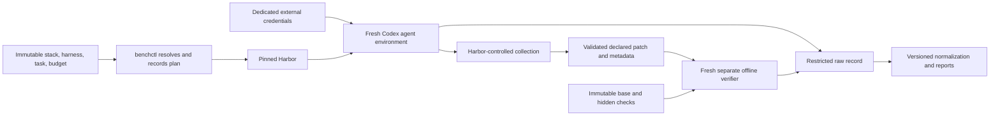

# Architecture

## Status

This is a proposed design grounded in the
[2026-09-04 research snapshot](research-snapshot.md), not runtime validation.
Harbor 0.22.0 and Codex 0.153.2 are exact candidate pins. Issue 2 must validate the
pair on Windows/WSL2 and Docker Linux containers; issue 3 finalizes the ADRs.

## Ownership

| Component | Owns | Must not become |
| --- | --- | --- |
| Harbor | Container lifecycle, native agent adaptation, network enforcement, collection, trajectories, separate verification, supported regrade | A second runner hidden in `benchctl` |
| `benchctl` | Config resolution, immutable harnesses, run manifests, experiment plans, normalization, integrity checks, statistics, reports | A container orchestration framework |
| Task package | Prompt, fixed base, environment recipe, evidence-backed rubric, declared artifact interface | Agent-visible hidden grading material |
| Verifier | Fresh base reconstruction, safe patch application, deterministic checks and structured evidence | A reused agent workspace |

The planned package boundaries are `apps/benchctl` and `packages/{schemas,core,
results,statistics,reporting}`. Configurations live under `benchmark/{tasks,suites,
stacks,experiments,harnesses}`; only synthetic repositories belong in `fixtures/`.
These directories and runtime packages are intentionally not created by bootstrap.

## Execution and trust boundaries

The credential edge terminates at the native client. It is not permission for
credentials to appear in workspace exports, logs, harnesses, or verifier inputs.
Native CLI credentials may be readable by agent-executed commands under the
upstream adapter; this is a residual threat to evaluate, not a claimed secret
broker. The host owns immutable task definitions and collector/verifier tooling.

Harbor supports explicit separate verifier environments, configured artifact
transfer, and network baselines. Its defaults are shared verification and public
networking. Planned tasks must explicitly select separate mode and a verifier
`no-network` baseline. Agent egress uses a measured allowlist from issue 2, including
setup behavior; the upstream provider must enforce it on the chosen runtime.
See [Harbor task configuration](https://github.com/harbor-framework/harbor/blob/4407eb5227a2ff4f0d3f16b2eb48849382fdf276/docs/content/docs/tasks/index.mdx).

## Collection is the critical missing proof

Do not ask Codex to export a patch and trust the result. The spike must establish
an independent snapshot/patch collector using Harbor's lifecycle. A candidate is
a trusted sidecar reading the stopped workspace with its own immutable baseline
and collector, emitting only a binary-capable patch plus metadata. This candidate
is unproven and is not an instruction to build a general collector framework.

The upstream collection path runs main hooks before stopping the main service;
sidecar collection follows a stop attempt, but stop failures are only warnings.
Artifact failures are also best-effort. A usable record therefore requires evidence
of successful quiescence, successful collection, complete inputs, and verified
hashes. Missing or conflicted entries must fail closed. Agent-controlled `.git`,
hooks, Git config, symlinks, and leftover processes cannot define the baseline or
trusted diff. [Collection implementation](https://github.com/harbor-framework/harbor/blob/4407eb5227a2ff4f0d3f16b2eb48849382fdf276/src/harbor/trial/trial.py).

Harbor implicitly transfers `/logs/artifacts` as well as configured inputs. The
artifact contract must account for that directory, reject undeclared contents and
paths that overlap verifier code or credentials, and prevent arbitrary material
from entering trusted execution. Host-side artifact destinations do not remap the
absolute replay paths. The verifier validates input before applying it.

## Results and failure handling

Write an immutable initial manifest before the agent starts. Append completion
and derived-result records referencing it; do not mutate the initial record to add
results. Keep raw Harbor files, native JSONL/session evidence, logs, collected
patches, hashes, verifier outputs, and provenance in a configurable ignored local
run root. Each completed run is immutable and has its own ID.

Normalization preserves authoritative facets, absent values, statuses, available
usage, and upstream provenance. Harbor `reward.json` contains numeric metrics;
non-numeric applicability, evidence, gates, and failure details need a separate
structured verifier record. Unknown incompatible output formats fail explicitly.
For subscription auth, an upstream API-price estimate is retained as upstream
metadata only and never presented as actual money spent.

Task failure is a completed valid grade with failed checks. Agent, provider,
runner, verifier, infrastructure failure, and cancellation are separate terminal
classifications; timeouts retain their stage. A failed verifier gives no valid
quality score. Regrades create new results from retained inputs without a provider
call or rewriting the original run. See [methodology](methodology.md).

## Fallback sequence

If issue 2 is not green, stop downstream implementation and open a narrow fallback
issue and ADR: first a supported `codex exec --json` Harbor adapter; next
host-managed Codex against an ephemeral Docker workspace retaining separate Harbor
verification; then evaluate Pier. Host execution increases host exposure and must
re-prove the same boundaries. Only build the missing adapter. No competing kernels
or custom sandbox/verifier platform are planned. [ADRs](adr/README.md) record the
five initial decisions as proposed pending evidence.
