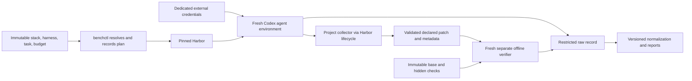

# Architecture

## Status

The five initial architecture decisions are accepted from the [2026-09-04 research snapshot](research-snapshot.md), issue 2 provider-free controls, and three successful native subscription samples. Harbor 0.22.0 and Codex 0.153.2 passed the synthetic spike on macOS Apple Silicon with Docker Desktop Linux/arm64 containers. The owner accepted qualified go on 2026-09-05, and issue 3 records the evidence boundaries. This remains feasibility evidence rather than production validation.

## Ownership

| Component | Owns | Must not become |
| --- | --- | --- |
| Harbor | Container lifecycle, native-agent adaptation, configured network enforcement, artifact transport, trajectories, separate-verifier orchestration, supported regrade transport | The authority for project schemas, validation, grading, or trust decisions |
| `benchctl` and project tooling | Config resolution, immutable harnesses, run manifests, trusted collector/verifier contracts, experiment plans, normalization, integrity gates, grading, statistics, reports | A second container orchestration framework |
| Task package | Prompt, fixed base, environment recipe, evidence-backed rubric, declared artifact interface | Agent-visible hidden grading material |
| Verifier | Fresh base reconstruction, safe patch application, deterministic checks and structured evidence | A reused agent workspace |

The package boundaries are `apps/benchctl` and `packages/{schemas,core,results, statistics,reporting}`. `packages/schemas` now owns the version-1 Valibot contracts for stack, harness, suite, experiment, task, run, and score documents. `packages/core` owns issue 5's immutable harness capture, validation, materialization, and diff contracts, exposed by the matching `benchctl harness` commands. Results, statistics, and reporting remain placeholders without runtime implementations. Configurations will live under `benchmark/{tasks,suites,stacks,experiments,harnesses}`; only synthetic repositories belong in `fixtures/`.

## Versioned document boundary

Every serialized v1 document uses `snake_case`, carries `document_type` and `schema_version: 1`, rejects unknown fields, and keeps its schema version separate from content revisions. Task, suite, harness, collector, verifier, scoring, environment, runner, network-policy, and analysis identities change independently.

Version 1 freezes when issue 4 merges. Any later change to required fields, accepted or rejected document shapes, field meaning, or runtime relationship semantics requires a new schema version and retained v1 parser and inspection artifacts for existing records. Migration machinery is deferred until a second version exists; that deferral does not permit incompatible changes under `/v1/`.

Valibot schemas are the runtime authority. Checked-in JSON Schema Draft 2020-12 files are deterministic structural inspection artifacts. They do not encode every same-document or cross-document rule and must not replace runtime validation. Pure relationship checks validate references and harness-effect invariants from already loaded documents without reading files or starting Harbor.

## Execution and trust boundaries

The credential edge terminates at the native client. It is not permission for credentials to appear in workspace exports, logs, harnesses, or verifier inputs. Native CLI credentials are readable by agent-executed commands under the upstream adapter. This is an accepted residual threat under unrestricted internet, not a claimed secret broker. The host owns immutable task definitions and collector/verifier tooling.

Harbor supports explicit separate verifier environments, configured artifact transfer, and network baselines. Its defaults are shared verification and public networking. Planned tasks must explicitly select separate mode and a verifier `no-network` baseline. Agent setup and execution explicitly use Harbor `public` networking: ordinary Docker bridge access without an agent egress sidecar, hostname allowlist, or traffic observer. The separate verifier additionally sets Docker `network_mode: none`. Harbor may create its pinned no-network sidecar for that verifier; the verifier itself does not share its namespace. See [Harbor task configuration](https://github.com/harbor-framework/harbor/blob/4407eb5227a2ff4f0d3f16b2eb48849382fdf276/docs/content/docs/tasks/index.mdx).

The v1 host identity records the macOS version, Apple Silicon architecture, Docker Desktop and Engine versions, LinuxKit kernel, and container architecture. The network gate exercises public HTTPS from the actual agent container and checks loopback-only networking in the fresh verifier through Harbor's complete lifecycle. Passing on this target is not evidence for Intel Mac, WSL2, or an arbitrary remote Docker daemon.

## Collection proof and remaining scope

Do not ask Codex to export a patch and trust the result. Issue 2 demonstrated an independent snapshot/patch collector using Harbor's lifecycle: a trusted sidecar reads the stopped workspace with its own immutable baseline and collector, emitting a binary-capable patch plus metadata. Its deterministic controls and three native samples support the synthetic task only, not a general collector framework.

The upstream collection path runs main hooks before stopping the main service; sidecar collection follows a stop attempt, but stop failures are only warnings. Artifact failures are also best-effort. A usable record therefore requires evidence of successful quiescence, successful collection, complete inputs, and verified hashes. Missing or conflicted entries must fail closed. Agent-controlled `.git`, hooks, Git config, symlinks, and leftover processes cannot define the baseline or trusted diff. [Collection implementation](https://github.com/harbor-framework/harbor/blob/4407eb5227a2ff4f0d3f16b2eb48849382fdf276/src/harbor/trial/trial.py).

## Agent-visible Git snapshot

Future task environments contain a newly initialized local repository with exactly one base commit. That commit gives the native agent working `git status`, `git diff`, and related daily commands. Materialization does not copy the source object database, refs, remotes, hooks, credentials, or future history, and retains only objects reachable from the new commit. The task records source provenance outside the agent-visible repository. The trusted collector still computes changes from its own immutable baseline and ignores agent-controlled `.git` data.

This removes local Git history; it does not make publicly reachable history secret. Because the agent has unrestricted internet, a production task is eligible for hidden-material or future-history claims only when its grading material and later solution are unavailable from public repositories, mirrors, packages, caches, or other reachable sources. The public synthetic fixture may validate plumbing, but it cannot by itself prove online secrecy.

The completed issue 2 runs remain Git-free evidence. Issue 6 implements and tests the synthetic one-commit snapshot; issue 14 applies the same rule to imported real tasks and proves future-history removal.

Harbor implicitly transfers `/logs/artifacts` as well as configured inputs. The artifact contract must account for that directory, reject undeclared contents and paths that overlap verifier code or credentials, and prevent arbitrary material from entering trusted execution. Host-side artifact destinations do not remap the absolute replay paths. The verifier validates input before applying it.

## Results and failure handling

Write an immutable initial manifest before the agent starts. Append completion and derived-result records referencing it; do not mutate the initial record to add results. Keep raw Harbor files, native JSONL/session evidence, the adapter's merged `codex.txt`, logs, collected patches, hashes, verifier outputs, and provenance in a configurable ignored local run root. Each completed run is immutable and has its own ID.

Secret scanning happens inside the restricted staging root before finalization. A suspected secret quarantines the record and blocks retention or publication. Scanning does not prove that all secrets are absent and does not prevent exfiltration while the public-network agent is running.

Normalization preserves authoritative facets, absent values, statuses, available usage, and upstream provenance. Harbor `reward.json` contains numeric metrics; non-numeric applicability, evidence, gates, and failure details need a separate structured verifier record. Unknown incompatible output formats fail explicitly. For subscription auth, an upstream API-price estimate is retained as upstream metadata only and never presented as actual money spent.

Task failure is a completed valid grade with failed checks. Agent, provider, runner, verifier, infrastructure failure, and cancellation are separate terminal classifications; timeouts retain their stage. A failed verifier gives no valid quality score. Regrades create new results from retained inputs without a provider call or rewriting the original run. See [methodology](methodology.md).

## Fallback sequence

Fallback depends on which capability is lost. If Harbor loses required native-agent adaptation while trustworthy collection and separate verification still work, stop dependent implementation and open a narrow issue and ADR for a supported `codex exec --json` Harbor adapter. If that is insufficient, host-managed Codex in an ephemeral Docker workspace may be evaluated only while the still-trusted Harbor collection and verifier boundary remains intact.

If Harbor loses trustworthy collection or separate verification, stop. A fallback that still relies on the lost property is invalid. Any Pier or alternative-boundary evaluation needs its own issue and ADR and must re-prove quiescence, independent capture, exact manifests and hashes, and fresh offline verification. Host execution increases host exposure. Accepted Git, auth-refresh, merged-stream, and public-network limitations do not trigger fallback by themselves. No competing kernel or custom sandbox/verifier platform is installed by default.
