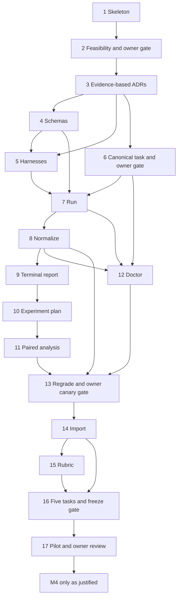

# Roadmap

The current backlog is defined by `.planning/backlog.json`, the complete local issue bodies, and their published GitHub counterparts. This roadmap owns the current execution order and owner decisions. `BOOTSTRAP_PLAN.md` and completed issue bodies retain historical requirements; the development policy below supersedes their one-session rules and early format-freeze obligations. Planning IDs below are stable; GitHub numbers and URLs are recorded in `.planning/github-state.json`.

## Current development plan

The 2026-09-11 owner-requested revision keeps the implemented engine and brings real-task feedback forward. This is pre-release development. No provider budget or private-data permission is granted by this roadmap.

1. **Finish the technical smoke check.** Reuse the checked post-#43 environment and provider-free evidence while their relevant inputs and toolchain still match. Prepare the exact current inputs, run assignment-level dry-run, and show the owner one redacted card for one native Codex invocation. Review collection, separate offline verification, native records, normalization, and cleanup. A valid task failure can pass this technical check; missing or untrusted evidence cannot. The check precedes owner private-data use, but does not block provider-free code work on sanitized fixtures.
2. **Issue 14: import one fixed source — implemented.** The provider-free path imports an exact local commit with explicit provenance, one-commit materialization, secret checks, external content-addressed storage, private retention, disposal, and a redacted tombstone. Sanitized fixtures cover it end to end. Owner private-data use still requires the technical check and source permission. Repository discovery and reproducible Docker rebuilds remain out of scope.
3. **Issue 15: support the first real rubric — implemented.** Task obligations now bind pristine evidence, doctor controls, strict verifier checks, weighted facet credit, applicability, and required behavior gates. The canonical task and sanitized `notification-retry` example calibrate the contract without a generalized rule engine or model call.
4. **Issue 16, first stage: finish one real task end to end.** Calibrate the task, then prepare skill-disabled/v1/v2 with one repeat each: three explicitly authorized exploratory invocations in one block. Inspect the report and changes before spending time on the remaining tasks. This is development feedback, not a reliable skill ranking or part of the final 45-run pilot. If the budget is not authorized, the calibrated task and concrete dry-run plan remain a useful milestone; provider-free authoring can continue.
5. **Issue 16, second stage: finish the five-task suite.** Reuse the proven authoring path. Freeze the task definitions, checked images, verifier, scoring, and harnesses before final comparison. Disclose exploratory use and outcome-driven tuning; exclude a task tuned from observed arm outcomes from final comparative claims and replace it if needed. Review task fairness and the final budget together.
6. **Issue 17: run the frozen pilot.** Five tasks, three arms, at least three repeats: 45 initial invocations under a separate explicit authorization. Keep paired blocks, unchanged checked inputs, raw evidence, and failure classifications. Inspect per-task results before accepting findings. M4 stays optional until a real need is shown.

Keep the existing issue IDs and dependency edges. A useful stage may be delivered before an entire issue closes, and a larger issue may span several focused PRs or sessions. Small fixes required for the authorized outcome belong with that work. A new issue is for independent out-of-scope work, not every failed check or changed digest.

### Post-#13 checkpoint and image policy

On commit `bcf3141f58991ccffbb98d80a5e82ae55d1dff24`, the v3 preparation passed ordinary checks, doctor integration, all canonical controls, interruption/resume, normalization, and verifier-only regrade `1 -> 0.875`, with zero provider calls. Upstream Harbor setup also reached `codex-cli 0.153.2` without auth. Preparation stopped before dry-run or canary because a fresh image differed from the historical digest in its run card. No owner canary verdict has been recorded.

The fresh agent image was `sha256:fc05cb893da7ffea0f4455c6107daf7781cd75c244908a309b11a6bc60b2158e`. Inspection found the same source, base commit, dependency content, and built output; timestamps changed the image identity. This does not prove all image behavior equivalent, but the fresh image passed its own calibration. Use its retained calibration and verify its identity before any new run plan. If relevant inputs change or evidence is unavailable, repeat affected checks and record the actual artifact.

[Issue 45](https://github.com/Perdolique/harness-bench/issues/45) is withdrawn from the critical path: reproducible image rebuilds are not a pilot requirement. Build, check, freeze, and reuse an image by digest. Do not replace an image inside a frozen plan or reuse a historical approval for changed runtime controls. A revised preflight card may use a newly checked artifact; preserving v1/v2/v3 evidence does not require implementing a new image builder. Later records must identify the superseded preparation and must not rewrite it.

GitHub issue 45 is closed as not planned. Its diagnosis is retained; the unsupported prerequisite is withdrawn, not implemented.

The current v1 run command requires an experiment with at least two distinct harness/stack arms even for one assignment. For the pending single canary, keep the second schema-control arm non-executable and outside the authorized budget. This existing format limitation does not justify a prerequisite refactor; a real three-arm development comparison uses the normal matrix without that placeholder.

Issue 15 changed the canonical task, verifier, scoring, rubric, and doctor identities. The older pending smoke-canary card is therefore stale and must be regenerated against the v3/v4/v2/v3/v2 identities before owner review. This does not authorize the canary, private-data access, or provider spend.

## Milestones

| Milestone | Exit outcome |
| --- | --- |
| M0 Feasibility | Issues 1–3: pinned development skeleton, end-to-end subscription feasibility, then evidence-based decisions. Owner gate after issue 2. |
| M1 Vertical-slice MVP | Issues 4–9: schemas, immutable harness, canonical task, one-run execution, normalization and terminal evidence. Owner calibration gate after issue 6. |
| M2 Controlled experiments | Issues 10–13 are implemented: execution, analysis, integrity and regrade. Technical canary remains pending before owner private-data use. |
| M3 Pilot benchmark | Issues 14–17: import, concrete rubric, one real development comparison, then five calibrated tasks and a frozen pilot. |
| M4 Hardening and expansion | Issues 18–27: optional evidence-justified work after the pilot, outside the v1 critical path. Metered schedules are a separate opt-in issue. |

## Dependency graph

## Recommended execution order

Issues 1–15 are implemented; do not rebuild that platform or repeat accepted historical reviews. Follow the current development plan above: regenerate and review the pending technical canary card against the current rubric identities, then get early one-task feedback within 16 and run the frozen pilot in 17. Technical prerequisites remain enforced by the graph. User-authorized work can continue across useful stages; a session boundary is not an acceptance criterion.

## Complete issue index

| Planning item | Milestone | Direct dependencies | Local issue body | GitHub |
| --- | --- | --- | --- | --- |
| 1 | M0 | None | [chore: initialize repository, pinned toolchains, and project governance](../.planning/issues/01-repository-skeleton.md) | [#1](https://github.com/Perdolique/harness-bench/issues/1) |
| 2 | M0 | 1 | [spike: prove Harbor + native Codex subscription + separate verifier end to end](../.planning/issues/02-feasibility-spike.md) | [#2](https://github.com/Perdolique/harness-bench/issues/2) |
| 3 | M0 | 2 | [docs: finalize architecture ADRs and threat model from feasibility evidence](../.planning/issues/03-evidence-based-decisions.md) | [#3](https://github.com/Perdolique/harness-bench/issues/3) |
| 4 | M1 | 3 | [feat: define versioned stack, harness, suite, experiment, task, run, and score schemas](../.planning/issues/04-versioned-schemas.md) | [#4](https://github.com/Perdolique/harness-bench/issues/4) |
| 5 | M1 | 3, 4 | [feat: capture, validate, hash, and materialize immutable harness bundles](../.planning/issues/05-immutable-harnesses.md) | [#5](https://github.com/Perdolique/harness-bench/issues/5) |
| 6 | M1 | 3 | [feat: add canonical frontend blast-radius task with separate deterministic verifier](../.planning/issues/06-canonical-frontend-task.md) | [#6](https://github.com/Perdolique/harness-bench/issues/6) |
| 7 | M1 | 4, 5, 6 | [feat: implement benchctl run over pinned Harbor](../.planning/issues/07-run-orchestration.md) | [#7](https://github.com/Perdolique/harness-bench/issues/7) |
| 8 | M1 | 7 | [feat: normalize Harbor outputs while preserving immutable raw records](../.planning/issues/08-normalize-results.md) | [#8](https://github.com/Perdolique/harness-bench/issues/8) |
| 9 | M1 | 8 | [feat: render a terminal report for one run](../.planning/issues/09-single-run-report.md) | [#9](https://github.com/Perdolique/harness-bench/issues/9) |
| 10 | M2 | 9 | [feat: execute versioned experiment matrices with A/B arms, repeats, and blocked interleaving](../.planning/issues/10-experiment-matrices.md) | [#10](https://github.com/Perdolique/harness-bench/issues/10) |
| 11 | M2 | 10 | [feat: produce paired experiment comparisons and uncertainty estimates](../.planning/issues/11-paired-comparison.md) | [#11](https://github.com/Perdolique/harness-bench/issues/11) |
| 12 | M2 | 6, 7, 8 | [feat: add benchctl doctor for task, verifier, environment, and harness integrity](../.planning/issues/12-integrity-doctor.md) | [#12](https://github.com/Perdolique/harness-bench/issues/12) |
| 13 | M2 | 8, 11, 12 | [feat: support verifier-only regrade and scoring revision migration](../.planning/issues/13-verifier-regrade.md) | [#13](https://github.com/Perdolique/harness-bench/issues/13) |
| 14 | M3 | 13 | [feat: import and freeze a task from a real repository commit or merged PR](../.planning/issues/14-real-task-import.md) | [#14](https://github.com/Perdolique/harness-bench/issues/14) |
| 15 | M3 | 14 | [feat: define blast-radius rubric and repository-contract evidence format](../.planning/issues/15-contract-rubric.md) | [#15](https://github.com/Perdolique/harness-bench/issues/15) |
| 16 | M3 | 14, 15 | [content: author and calibrate the first five real benchmark tasks](../.planning/issues/16-pilot-task-suite.md) | [#16](https://github.com/Perdolique/harness-bench/issues/16) |
| 17 | M3 | 16 | [experiment: compare skill disabled vs v1 vs v2 on the pilot suite](../.planning/issues/17-first-skill-experiment.md) | [#17](https://github.com/Perdolique/harness-bench/issues/17) |
| 18 | M4 | 12, 13, 17 | [feat: add provider-free CI integrity and redaction validation](../.planning/issues/18-ci-integrity.md) | [#18](https://github.com/Perdolique/harness-bench/issues/18) |
| 19 | M4 | 11, 13, 17 | [feat: static HTML/web dashboard over normalized experiment data](../.planning/issues/19-static-dashboard.md) | [#19](https://github.com/Perdolique/harness-bench/issues/19) |
| 20 | M4 | 13, 17 | [feat: add a second native agent/provider as a complete stack](../.planning/issues/20-second-native-agent.md) | [#20](https://github.com/Perdolique/harness-bench/issues/20) |
| 21 | M4 | 13, 17 | [feat: add API-auth and billing-aware experiment mode](../.planning/issues/21-api-billing-mode.md) | [#21](https://github.com/Perdolique/harness-bench/issues/21) |
| 22 | M4 | 15, 17 | [feat: add code-review benchmark task type and finding matcher](../.planning/issues/22-review-task-type.md) | [#22](https://github.com/Perdolique/harness-bench/issues/22) |
| 23 | M4 | 13, 16, 17 | [feat: add holdout/sealed-suite workflow](../.planning/issues/23-sealed-suite.md) | [#23](https://github.com/Perdolique/harness-bench/issues/23) |
| 24 | M4 | 12, 15, 17 | [feat: add selective mutation probes for agent-authored tests](../.planning/issues/24-selective-mutation-probes.md) | [#24](https://github.com/Perdolique/harness-bench/issues/24) |
| 25 | M4 | 13, 17 | [feat: evaluate remote sandbox/executor backends](../.planning/issues/25-remote-executor-evaluation.md) | [#25](https://github.com/Perdolique/harness-bench/issues/25) |
| 26 | M4 | 2, 3, 17 | [research: evaluate Pier trajectory fidelity against current Harbor](../.planning/issues/26-pier-fidelity-research.md) | [#26](https://github.com/Perdolique/harness-bench/issues/26) |
| 27 | M4 | 18, 21 | [feat: add explicitly opted-in metered experiment schedules](../.planning/issues/27-optional-metered-schedules.md) | [#27](https://github.com/Perdolique/harness-bench/issues/27) |

## Owner gates and dependencies

| Gate | Evidence required before downstream work |
| --- | --- |
| After 2, accepted | Subscription feasibility, native fidelity, independent collection and separate verification. Revisit only if relevant assumptions change. |
| After 6, accepted | Canonical task realism and fair grading. Ordinary calibration remains an implementation check. |
| After 13, pending | Approve the one-call card and review the resulting technical evidence before owner private-data use. Provider-free fixture work can continue. |
| During 16 | Authorize the concrete three-call exploratory plan if desired; inspect the first real task before expanding authoring. |
| Before 17 | Review the five-task suite and 45-call pilot plan together; this freezes comparative inputs and authorizes only the stated budget. |
| After 17 | Inspect per-task evidence and accept or reject conclusions. Authorize M4 only for a demonstrated need. |

The issue 2 owner gate was accepted on 2026-09-05 with explicit qualifications: the public-network medium and low runs passed. A separately authorized additional low run then passed, completing the matching-input low pair; issue 3 accepted the architecture with a future one-base-commit Git workspace, fail-closed owner login for unproved auth refresh, and native stream-merging, public-network, and platform limitations. See the [evidence report](spikes/harbor-codex-subscription.md) and [accepted ADRs](adr/README.md).

The 2026-09-05 corrective review sets conservative v1 defaults unless a later issue and ADR deliberately change them: loss of trustworthy collection or separate verification is fail-closed; subscription concurrency is exactly one; both arms of a block finish within 24 hours and are invalidated by a known stack/provider change; private task/run records declare an expiry and default to 90 days. The issue 6 realism and fairness gate was accepted in [PR #34](https://github.com/Perdolique/harness-bench/pull/34); later gates remain pending. GitHub's native issue dependencies enforce prerequisite closure, but closing a dependency does not silently satisfy its owner gate. The `decision-required` label identifies owner decisions, including deferred M4 candidate/budget choices.

## M4 scope and split rationale

Planning item 18 combined provider-free CI integrity work and optional metered scheduling, which can be reviewed independently. Under section 11 these are split into item 18 (CI validation/redaction) and item 27 (explicitly opted-in metered schedules after 18 and API mode 21). The original 26 planning topics are all preserved; the backlog contains 27 issues. All M4 work depends directly or transitively on pilot review and is outside the v1 critical path.

M4 item dependencies are in the table rather than speculative parallel tracks. Items 19–26 remain bounded: one static local dashboard, one selected second native agent, explicit API auth, one calibrated review-task matcher, one sealed-suite workflow, selective probes for one task, one remote-executor evaluation, and one Pier fidelity investigation. A pre-v1 Harbor failure requires a new focused fallback issue at that time; the post-pilot Pier research issue cannot unblock it.

## Current boundary

M0–M2 and the issue 15 executable-rubric implementation are complete. The refreshed technical canary and real-task authoring remain. The 2026-09-11 planning revision changes development sequencing, compatibility obligations, and workflow rules; it does not authorize native execution, approve private-data access, or claim that the pending canary passed.
