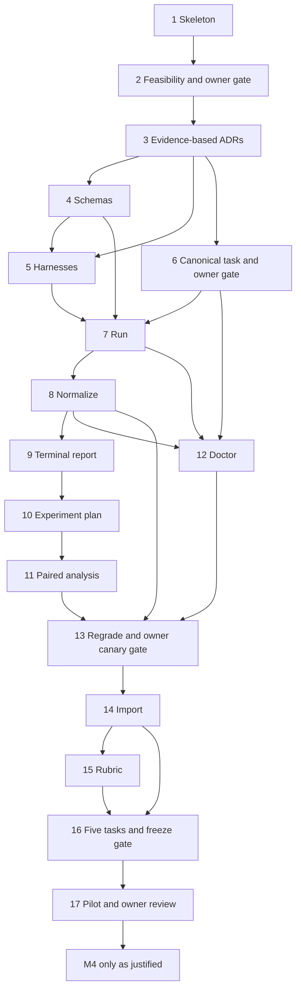

# Roadmap

The current backlog is defined by `.planning/backlog.json`, the complete local issue bodies, and their published GitHub counterparts. This roadmap owns the current execution order and owner decisions. `BOOTSTRAP_PLAN.md` and completed issue bodies retain historical requirements; the development policy below supersedes their one-session rules and early format-freeze obligations. Planning IDs below are stable; GitHub numbers and URLs are recorded in `.planning/github-state.json`.

## Current development plan

The current path keeps the implemented engine and brings real-task feedback forward.

| Stage | Status |
| --- | --- |
| Technical smoke | Accepted on 2026-09-12. It proved the measurement path, not task quality or private-data use. |
| Issue 14 import | Implemented with one-commit materialization, secret checks, private retention and disposal. |
| Issue 15 rubric | Implemented with executable obligations, doctor controls and strict verifier evidence. |
| Issue 16 early smoke | Complete. The three calls are development feedback, not a paired ranking. |
| Personal five-task matrix | Suite frozen and 45-call ceiling authorized. Execution is paused for the collector replay fix. |
| Formal issue 17 pilot | Not started. It still needs eligible tasks before secrecy-dependent claims. |

Keep existing issue IDs and dependency edges. Put small fixes in the authorized work. Create a new issue only for independent work outside that scope.

### Issue 16 first-stage preparation

On 2026-09-12, the owner authorized one private frontend smoke case. Its prepared source, preparation patch and provenance, solutions, hidden checks, build contexts, dependency archives, and raw evidence remain in an external owner-only store. No private source was added to this checkout. The source has one isolated base commit, fixed dependencies, and a 90-day retention deadline. The disposal inventory also covers local images and build caches, which import disposal does not manage.

Provider-free preparation passed the complete smoke doctor: pristine, reference, alternate, six negative controls, and the reference repeat. Both implementations passed the full rubric; the repeat preserved checks and scores. The controls detected early persistence, timer-based completion, broken storage handling, test deletion, disabled regression checks, and an unrelated edit. Image-layer visibility, independent collection, separate offline verification, credential checks, evidence stability, and cleanup passed. Three complete skill-disabled/v1/v2 harnesses passed capture, validation, configuration checks, and content diffing.

The completed behavior is reachable in public application assets. This case is explicitly ineligible for skill-quality claims and does not count toward the final five-task suite. Issue 16 remains open. The owner authorized three native calls; all three retained valid task-failure grades with passing regression, scope, verifier-integrity, credential, and cleanup evidence. Concurrency stayed at one and no provider retry occurred.

Both skill harnesses were read through normal discovery, while the disabled arm had no target skill. Because the recovered first result and the two-arm continuation belong to different blocks, no combined comparison is valid. This source permission does not authorize other private tasks.

### Post-#13 checkpoint and image policy

On commit `bcf3141f58991ccffbb98d80a5e82ae55d1dff24`, the v3 preparation passed ordinary checks, doctor integration, all canonical controls, interruption/resume, normalization, and verifier-only regrade `1 -> 0.875`, with zero provider calls. Upstream Harbor setup also reached `codex-cli 0.153.2` without auth. That historical preparation stopped before dry-run or canary because a fresh image differed from the digest in its run card. It was later superseded by the accepted current-input canary below.

The fresh agent image was `sha256:fc05cb893da7ffea0f4455c6107daf7781cd75c244908a309b11a6bc60b2158e`. Inspection found the same source, base commit, dependency content, and built output; timestamps changed the image identity. This does not prove all image behavior equivalent, but the fresh image passed its own calibration. That image remains bound to the superseded preparation and is not a default for later plans. For each new run plan, validate and freeze the actual task-specific image. If relevant inputs change or evidence is unavailable, repeat affected checks and record the actual artifact.

[Issue 45](https://github.com/Perdolique/harness-bench/issues/45) is withdrawn from the critical path: reproducible image rebuilds are not a pilot requirement. Build, check, freeze, and reuse an image by digest. Do not replace an image inside a frozen plan or reuse a historical approval for changed runtime controls. A new plan may use a newly checked artifact; preserving v1/v2/v3 evidence does not require implementing a new image builder. Later records must identify the superseded preparation and must not rewrite it.

GitHub issue 45 is closed as not planned. Its diagnosis is retained; the unsupported prerequisite is withdrawn, not implemented.

The current v1 run command requires an experiment with at least two distinct harness/stack arms even for one assignment. The accepted single canary kept its second schema-control arm non-executable and outside the authorized budget. This existing format limitation does not justify a prerequisite refactor; a real three-arm development comparison uses the normal matrix without that placeholder.

Issue 15 changed the canonical task, verifier, scoring, rubric, and doctor identities, so the older smoke card stayed immutable and stale. The replacement card bound task/environment/collector/verifier/scoring/rubric revisions v3/v2/v3/v4/v2/v3 on commit `e611f8f2baa9abf4605d2a686bb4044fcb7954e5`. The owner authorized exactly one native invocation and accepted its technical evidence as `GO` on 2026-09-12. Raw evidence remains in the external private run root; the repository records only this safe summary. That canary did not authorize private-data access or issue 16 invocations. The later first-stage source permission and three-call exploratory budget were used in full as recorded above; neither authorization carries forward.

## Milestones

| Milestone | Exit outcome |
| --- | --- |
| M0 Feasibility | Issues 1–3: pinned development skeleton, end-to-end subscription feasibility, then evidence-based decisions. Owner gate after issue 2. |
| M1 Vertical-slice MVP | Issues 4–9: schemas, immutable harness, canonical task, one-run execution, normalization and terminal evidence. Owner calibration gate after issue 6. |
| M2 Controlled experiments | Issues 10–13 are implemented: execution, analysis, integrity and regrade. The post-13 technical canary received owner `GO` on 2026-09-12. |
| M3 Pilot benchmark | Issues 14–17: import, concrete rubric, one real development comparison, then five calibrated tasks and a frozen pilot. |
| M4 Hardening and expansion | Issues 18–27: optional evidence-justified work after the pilot, outside the v1 critical path. Metered schedules are a separate opt-in issue. |

## Dependency graph

## Recommended execution order

Issues 1–15, the post-13 technical smoke, the issue 16 early feedback, and the exploratory five-task freeze are complete. Do not rebuild that platform or repeat accepted historical reviews. Follow the current development plan above: fix the collector replay defect, refresh only affected physical inputs, and continue the personal matrix within its fixed ceiling. The formal issue 17 pilot still needs an eligible suite. Technical prerequisites remain enforced by the graph; a session boundary is not an acceptance criterion.

## Complete issue index

| Planning item | Milestone | Direct dependencies | Local issue body | GitHub |
| --- | --- | --- | --- | --- |
| 1 | M0 | None | [chore: initialize repository, pinned toolchains, and project governance](../.planning/issues/01-repository-skeleton.md) | [#1](https://github.com/Perdolique/harness-bench/issues/1) |
| 2 | M0 | 1 | [spike: prove Harbor + native Codex subscription + separate verifier end to end](../.planning/issues/02-feasibility-spike.md) | [#2](https://github.com/Perdolique/harness-bench/issues/2) |
| 3 | M0 | 2 | [docs: finalize architecture ADRs and threat model from feasibility evidence](../.planning/issues/03-evidence-based-decisions.md) | [#3](https://github.com/Perdolique/harness-bench/issues/3) |
| 4 | M1 | 3 | [feat: define versioned stack, harness, suite, experiment, task, run, and score schemas](../.planning/issues/04-versioned-schemas.md) | [#4](https://github.com/Perdolique/harness-bench/issues/4) |
| 5 | M1 | 3, 4 | [feat: capture, validate, hash, and materialize immutable harness bundles](../.planning/issues/05-immutable-harnesses.md) | [#5](https://github.com/Perdolique/harness-bench/issues/5) |
| 6 | M1 | 3 | [feat: add canonical frontend blast-radius task with separate deterministic verifier](../.planning/issues/06-canonical-frontend-task.md) | [#6](https://github.com/Perdolique/harness-bench/issues/6) |
| 7 | M1 | 4, 5, 6 | [feat: implement benchctl run over pinned Harbor](../.planning/issues/07-run-orchestration.md) | [#7](https://github.com/Perdolique/harness-bench/issues/7) |
| 8 | M1 | 7 | [feat: normalize Harbor outputs while preserving immutable raw records](../.planning/issues/08-normalize-results.md) | [#8](https://github.com/Perdolique/harness-bench/issues/8) |
| 9 | M1 | 8 | [feat: render a terminal report for one run](../.planning/issues/09-single-run-report.md) | [#9](https://github.com/Perdolique/harness-bench/issues/9) |
| 10 | M2 | 9 | [feat: execute versioned experiment matrices with A/B arms, repeats, and blocked interleaving](../.planning/issues/10-experiment-matrices.md) | [#10](https://github.com/Perdolique/harness-bench/issues/10) |
| 11 | M2 | 10 | [feat: produce paired experiment comparisons and uncertainty estimates](../.planning/issues/11-paired-comparison.md) | [#11](https://github.com/Perdolique/harness-bench/issues/11) |
| 12 | M2 | 6, 7, 8 | [feat: add benchctl doctor for task, verifier, environment, and harness integrity](../.planning/issues/12-integrity-doctor.md) | [#12](https://github.com/Perdolique/harness-bench/issues/12) |
| 13 | M2 | 8, 11, 12 | [feat: support verifier-only regrade and scoring revision migration](../.planning/issues/13-verifier-regrade.md) | [#13](https://github.com/Perdolique/harness-bench/issues/13) |
| 14 | M3 | 13 | [feat: import and freeze a task from a real repository commit or merged PR](../.planning/issues/14-real-task-import.md) | [#14](https://github.com/Perdolique/harness-bench/issues/14) |
| 15 | M3 | 14 | [feat: define blast-radius rubric and repository-contract evidence format](../.planning/issues/15-contract-rubric.md) | [#15](https://github.com/Perdolique/harness-bench/issues/15) |
| 16 | M3 | 14, 15 | [content: author and calibrate the first five real benchmark tasks](../.planning/issues/16-pilot-task-suite.md) | [#16](https://github.com/Perdolique/harness-bench/issues/16) |
| 17 | M3 | 16 | [experiment: compare skill disabled vs v1 vs v2 on the pilot suite](../.planning/issues/17-first-skill-experiment.md) | [#17](https://github.com/Perdolique/harness-bench/issues/17) |
| 18 | M4 | 12, 13, 17 | [feat: add provider-free CI integrity and redaction validation](../.planning/issues/18-ci-integrity.md) | [#18](https://github.com/Perdolique/harness-bench/issues/18) |
| 19 | M4 | 11, 13, 17 | [feat: static HTML/web dashboard over normalized experiment data](../.planning/issues/19-static-dashboard.md) | [#19](https://github.com/Perdolique/harness-bench/issues/19) |
| 20 | M4 | 13, 17 | [feat: add a second native agent/provider as a complete stack](../.planning/issues/20-second-native-agent.md) | [#20](https://github.com/Perdolique/harness-bench/issues/20) |
| 21 | M4 | 13, 17 | [feat: add API-auth and billing-aware experiment mode](../.planning/issues/21-api-billing-mode.md) | [#21](https://github.com/Perdolique/harness-bench/issues/21) |
| 22 | M4 | 15, 17 | [feat: add code-review benchmark task type and finding matcher](../.planning/issues/22-review-task-type.md) | [#22](https://github.com/Perdolique/harness-bench/issues/22) |
| 23 | M4 | 13, 16, 17 | [feat: add holdout/sealed-suite workflow](../.planning/issues/23-sealed-suite.md) | [#23](https://github.com/Perdolique/harness-bench/issues/23) |
| 24 | M4 | 12, 15, 17 | [feat: add selective mutation probes for agent-authored tests](../.planning/issues/24-selective-mutation-probes.md) | [#24](https://github.com/Perdolique/harness-bench/issues/24) |
| 25 | M4 | 13, 17 | [feat: evaluate remote sandbox/executor backends](../.planning/issues/25-remote-executor-evaluation.md) | [#25](https://github.com/Perdolique/harness-bench/issues/25) |
| 26 | M4 | 2, 3, 17 | [research: evaluate Pier trajectory fidelity against current Harbor](../.planning/issues/26-pier-fidelity-research.md) | [#26](https://github.com/Perdolique/harness-bench/issues/26) |
| 27 | M4 | 18, 21 | [feat: add explicitly opted-in metered experiment schedules](../.planning/issues/27-optional-metered-schedules.md) | [#27](https://github.com/Perdolique/harness-bench/issues/27) |

## Owner gates and dependencies

| Gate | Evidence required before downstream work |
| --- | --- |
| After 2, accepted | Subscription feasibility, native fidelity, independent collection and separate verification. Revisit only if relevant assumptions change. |
| After 6, accepted | Canonical task realism and fair grading. Ordinary calibration remains an implementation check. |
| After 13, accepted | The 2026-09-12 `GO` accepts the one-call technical evidence. Private-data use and later provider budgets remain separate owner decisions. |
| During 16 | The first-stage source permission and three-call exploratory budget are exhausted. The current personal matrix has its own 45-call ceiling; any other private source still needs owner review. |
| Before 17 | Review an eligible five-task suite and its formal 45-call pilot plan together; this freezes comparative inputs and authorizes only the stated budget. |
| After 17 | Inspect per-task evidence and accept or reject conclusions. Authorize M4 only for a demonstrated need. |

These gates govern formal benchmark claims. Owner-only exploratory work follows [the development instructions](../AGENTS.md#owner-decisions).

The issue 2 owner gate was accepted on 2026-09-05 with explicit qualifications: the public-network medium and low runs passed. A separately authorized additional low run then passed, completing the matching-input low pair; issue 3 accepted the architecture with a future one-base-commit Git workspace, fail-closed owner login for unproved auth refresh, and native stream-merging, public-network, and platform limitations. See the [evidence report](spikes/harbor-codex-subscription.md) and [accepted ADRs](adr/README.md).

The 2026-09-05 corrective review sets conservative v1 defaults unless a later issue and ADR deliberately change them. Loss of trustworthy collection or separate verification is fail-closed. Subscription concurrency is one. Both arms of a block finish within 24 hours and are invalidated by a known stack or provider change. Private task and run records declare an expiry that defaults to 90 days.

The issue 6 realism and fairness gate was accepted in [PR #34](https://github.com/Perdolique/harness-bench/pull/34), and the post-13 technical smoke gate was accepted on 2026-09-12; later gates remain pending. GitHub's native issue dependencies enforce prerequisite closure, but closing a dependency does not silently satisfy its owner gate. The `decision-required` label identifies owner decisions, including deferred M4 candidate/budget choices.

## M4 scope and split rationale

Planning item 18 combined provider-free CI integrity work and optional metered scheduling, which can be reviewed independently. Under section 11 these are split into item 18 (CI validation/redaction) and item 27 (explicitly opted-in metered schedules after 18 and API mode 21). The original 26 planning topics are all preserved; the backlog contains 27 issues. All M4 work depends directly or transitively on pilot review and is outside the v1 critical path.

M4 item dependencies are in the table rather than speculative parallel tracks. Items 19–26 remain bounded: one static local dashboard, one selected second native agent, explicit API auth, one calibrated review-task matcher, one sealed-suite workflow, selective probes for one task, one remote-executor evaluation, and one Pier fidelity investigation. A pre-v1 Harbor failure requires a new focused fallback issue at that time; the post-pilot Pier research issue cannot unblock it.

## Current boundary

M0–M2, the issue 15 executable-rubric implementation, the refreshed technical canary, and the issue 16 first-stage smoke are complete. The personal exploratory web catalog is prepared, its smoke doctor calibration passed, and a five-task derived selection is frozen. Public reachability remains `ineligible`, and issue 16 remains open because this suite cannot support secrecy-dependent comparative claims. Issue 17 has not started. The owner separately authorized a fixed 45-call ceiling for the personal exploratory matrix; this does not increase that ceiling or turn it into the formal issue 17 pilot. Each additional private source still requires owner permission.
