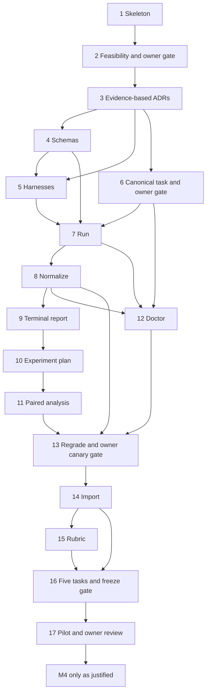

# Roadmap

The current backlog is defined by `.planning/backlog.json`, the complete local issue bodies, and their published GitHub counterparts. `BOOTSTRAP_PLAN.md` is retained as source provenance for those published bodies, not as a second requirements authority. Planning IDs below are stable; GitHub numbers and URLs are recorded in `.planning/github-state.json`. Every issue has a complete local body and the global Definition of Done.

## Milestones

| Milestone | Exit outcome |
| --- | --- |
| M0 Feasibility | Issues 1–3: pinned development skeleton, end-to-end subscription feasibility, then evidence-based decisions. Owner gate after issue 2. |
| M1 Vertical-slice MVP | Issues 4–9: schemas, immutable harness, canonical task, one-run execution, normalization and terminal evidence. Owner calibration gate after issue 6. |
| M2 Controlled experiments | Issues 10–13: blocked/repeated execution, paired uncertainty, integrity checks and verifier-only regrade. Owner dry-run/canary gate after issue 13. |
| M3 Pilot benchmark | Issues 14–17: import/freeze real tasks, evidence rubric, five calibrated tasks and first skill comparison. Freeze gate after 16; evidence review after 17. |
| M4 Hardening and expansion | Issues 18–27: optional evidence-justified work after the pilot, outside the v1 critical path. Metered schedules are a separate opt-in issue. |

## Dependency graph

## Recommended execution order

Use one issue per agent session and PR. Complete 1 → 2 → owner gate → 3. Issue 4 precedes 5; issue 6 depends only on 3 and can be developed independently of 4/5 after feasibility acceptance. Complete 4/5/6 and the issue 6 owner gate before 7, then 8 → 9. Issue 10 follows 9; issue 12 can proceed independently once 6–8 are complete. Finish 11 after 10, then 13 after 8/11/12, then 14 → 15 → 16 → 17 with the owner gates below. No implementation is part of the bootstrap session.

## Complete issue index

| Planning item | Milestone | Direct dependencies | Local issue body | GitHub |
| --- | --- | --- | --- | --- |
| 1 | M0 | None | [chore: initialize repository, pinned toolchains, and project governance](../.planning/issues/01-repository-skeleton.md) | [#1](https://github.com/Perdolique/harness-bench/issues/1) |
| 2 | M0 | 1 | [spike: prove Harbor + native Codex subscription + separate verifier end to end](../.planning/issues/02-feasibility-spike.md) | [#2](https://github.com/Perdolique/harness-bench/issues/2) |
| 3 | M0 | 2 | [docs: finalize architecture ADRs and threat model from feasibility evidence](../.planning/issues/03-evidence-based-decisions.md) | [#3](https://github.com/Perdolique/harness-bench/issues/3) |
| 4 | M1 | 3 | [feat: define versioned stack, harness, suite, experiment, task, run, and score schemas](../.planning/issues/04-versioned-schemas.md) | [#4](https://github.com/Perdolique/harness-bench/issues/4) |
| 5 | M1 | 3, 4 | [feat: capture, validate, hash, and materialize immutable harness bundles](../.planning/issues/05-immutable-harnesses.md) | [#5](https://github.com/Perdolique/harness-bench/issues/5) |
| 6 | M1 | 3 | [feat: add canonical frontend blast-radius task with separate deterministic verifier](../.planning/issues/06-canonical-frontend-task.md) | [#6](https://github.com/Perdolique/harness-bench/issues/6) |
| 7 | M1 | 4, 5, 6 | [feat: implement benchctl run over pinned Harbor](../.planning/issues/07-run-orchestration.md) | [#7](https://github.com/Perdolique/harness-bench/issues/7) |
| 8 | M1 | 7 | [feat: normalize Harbor outputs while preserving immutable raw records](../.planning/issues/08-normalize-results.md) | [#8](https://github.com/Perdolique/harness-bench/issues/8) |
| 9 | M1 | 8 | [feat: render a terminal report for one run](../.planning/issues/09-single-run-report.md) | [#9](https://github.com/Perdolique/harness-bench/issues/9) |
| 10 | M2 | 9 | [feat: execute versioned experiment matrices with A/B arms, repeats, and blocked interleaving](../.planning/issues/10-experiment-matrices.md) | [#10](https://github.com/Perdolique/harness-bench/issues/10) |
| 11 | M2 | 10 | [feat: produce paired experiment comparisons and uncertainty estimates](../.planning/issues/11-paired-comparison.md) | [#11](https://github.com/Perdolique/harness-bench/issues/11) |
| 12 | M2 | 6, 7, 8 | [feat: add benchctl doctor for task, verifier, environment, and harness integrity](../.planning/issues/12-integrity-doctor.md) | [#12](https://github.com/Perdolique/harness-bench/issues/12) |
| 13 | M2 | 8, 11, 12 | [feat: support verifier-only regrade and scoring revision migration](../.planning/issues/13-verifier-regrade.md) | [#13](https://github.com/Perdolique/harness-bench/issues/13) |
| 14 | M3 | 13 | [feat: import and freeze a task from a real repository commit or merged PR](../.planning/issues/14-real-task-import.md) | [#14](https://github.com/Perdolique/harness-bench/issues/14) |
| 15 | M3 | 14 | [feat: define blast-radius rubric and repository-contract evidence format](../.planning/issues/15-contract-rubric.md) | [#15](https://github.com/Perdolique/harness-bench/issues/15) |
| 16 | M3 | 14, 15 | [content: author and calibrate the first five real benchmark tasks](../.planning/issues/16-pilot-task-suite.md) | [#16](https://github.com/Perdolique/harness-bench/issues/16) |
| 17 | M3 | 16 | [experiment: compare skill disabled vs v1 vs v2 on the pilot suite](../.planning/issues/17-first-skill-experiment.md) | [#17](https://github.com/Perdolique/harness-bench/issues/17) |
| 18 | M4 | 12, 13, 17 | [feat: add provider-free CI integrity and redaction validation](../.planning/issues/18-ci-integrity.md) | [#18](https://github.com/Perdolique/harness-bench/issues/18) |
| 19 | M4 | 11, 13, 17 | [feat: static HTML/web dashboard over normalized experiment data](../.planning/issues/19-static-dashboard.md) | [#19](https://github.com/Perdolique/harness-bench/issues/19) |
| 20 | M4 | 13, 17 | [feat: add a second native agent/provider as a complete stack](../.planning/issues/20-second-native-agent.md) | [#20](https://github.com/Perdolique/harness-bench/issues/20) |
| 21 | M4 | 13, 17 | [feat: add API-auth and billing-aware experiment mode](../.planning/issues/21-api-billing-mode.md) | [#21](https://github.com/Perdolique/harness-bench/issues/21) |
| 22 | M4 | 15, 17 | [feat: add code-review benchmark task type and finding matcher](../.planning/issues/22-review-task-type.md) | [#22](https://github.com/Perdolique/harness-bench/issues/22) |
| 23 | M4 | 13, 16, 17 | [feat: add holdout/sealed-suite workflow](../.planning/issues/23-sealed-suite.md) | [#23](https://github.com/Perdolique/harness-bench/issues/23) |
| 24 | M4 | 12, 15, 17 | [feat: add selective mutation probes for agent-authored tests](../.planning/issues/24-selective-mutation-probes.md) | [#24](https://github.com/Perdolique/harness-bench/issues/24) |
| 25 | M4 | 13, 17 | [feat: evaluate remote sandbox/executor backends](../.planning/issues/25-remote-executor-evaluation.md) | [#25](https://github.com/Perdolique/harness-bench/issues/25) |
| 26 | M4 | 2, 3, 17 | [research: evaluate Pier trajectory fidelity against current Harbor](../.planning/issues/26-pier-fidelity-research.md) | [#26](https://github.com/Perdolique/harness-bench/issues/26) |
| 27 | M4 | 18, 21 | [feat: add explicitly opted-in metered experiment schedules](../.planning/issues/27-optional-metered-schedules.md) | [#27](https://github.com/Perdolique/harness-bench/issues/27) |

## Owner gates and blockers

| Gate | Evidence required before downstream work |
| --- | --- |
| After 2 | Accept subscription auth safety, native workflow fidelity, unrestricted agent internet and offline verifier, traces/usage, independent patch collection and separate offline verifier. If not green, stop issues 4–13 and open a narrow fallback issue/ADR. |
| After 6 | Accept prompt realism, inferable evidence-backed obligations, alternate implementations and fair scope grading before issue 7. |
| After 13 | Review a complete local dry run and one explicitly authorized subscription canary before importing private real tasks in 14. |
| After 16 | Approve calibration and freeze task/suite/verifier/scoring revisions before comparative experiment 17. |
| After 17 | Inspect per-task trajectories and patches; decide whether measured behavior is useful before activating M4. |

The issue 2 owner gate was accepted on 2026-09-05 with explicit qualifications: the public-network medium and low runs passed. A separately authorized additional low run then passed, completing the matching-input low pair; issue 3 accepted the architecture with a future one-base-commit Git workspace, fail-closed owner login for unproved auth refresh, and native stream-merging, public-network, and platform limitations. See the [evidence report](spikes/harbor-codex-subscription.md) and [accepted ADRs](adr/README.md).

The 2026-09-05 corrective review sets conservative v1 defaults unless a later issue and ADR deliberately change them: loss of trustworthy collection or separate verification is fail-closed; subscription concurrency is exactly one; both arms of a block finish within 24 hours and are invalidated by a known stack/provider change; private task/run records declare an expiry and default to 90 days. All later gates remain pending. Closing a dependency is necessary but does not silently satisfy its owner gate. The `blocked` label marks unmet direct dependencies or gates; an implementing agent verifies closure/merge and recorded acceptance before starting, then removes blockers only when justified. The `decision-required` label identifies owner decisions, including deferred M4 candidate/budget choices.

## M4 scope and split rationale

Planning item 18 combined provider-free CI integrity work and optional metered scheduling, which can be reviewed independently. Under section 11 these are split into item 18 (CI validation/redaction) and item 27 (explicitly opted-in metered schedules after 18 and API mode 21). The original 26 planning topics are all preserved; the backlog contains 27 issues. All M4 work depends directly or transitively on pilot review and is outside the v1 critical path.

M4 item dependencies are in the table rather than speculative parallel tracks. Items 19–26 remain bounded: one static local dashboard, one selected second native agent, explicit API auth, one calibrated review-task matcher, one sealed-suite workflow, selective probes for one task, one remote-executor evaluation, and one Pier fidelity investigation. A pre-v1 Harbor failure requires a new focused fallback issue at that time; the post-pilot Pier research issue cannot unblock it.

## Current boundary

M0 is complete after issue 3 and its focused PR merged. Issue 4 is closed and its versioned v1 schemas are frozen. Issue 5 is the active M1 immutable-harness slice; issue 6 remains independently selectable. Issue 7 stays blocked until issues 5 and 6 are closed and the issue 6 owner calibration gate is recorded. No task packaging or run orchestration is implemented by the issue 5 branch.
